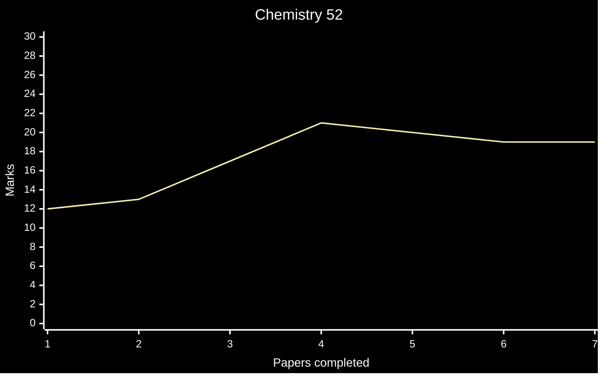

# Chemistry P5 (9701/5)

## Graphical Representation

Marks of the past Chemistry (9701) Planning, Analysis and Evaluation (Paper 5) papers have been graphed above.

## Formulas Worth Knowing
- moles formula: $$mol = \frac{mass}{M_r} = \frac{concentration}{volume}$$
- Ideal Gas law: $$PV=nRT$$
    - $P$ = Pressure ($Pa$)
    - $V$ = Volume ($m^3$)
    - $n$ = Number of moles
    - $R$ = Universal Gas Constant ($8.31\ J\ K^{-1}\ mol^{-1}$)
    - $T$ = Temperature ($K$)
- Dilution(?) formula: $$C_1 V_1 = C_2 V_2$$
    - $C_x$ = Concentration
    - $V_x$ = Volume
- Uncertainty and Percentage Uncertainty: $$uncertainty = \frac{\Delta x}{x}$$ $$\% \ uncertainty = \frac{\Delta x}{x} \times 100$$
- Percentage Yield: $$\%\ yield= \frac{actual\ yield}{predicted\ yield} \times 100$$

## Error Log & Solutions
A list of all the mistakes to look out for in the exam. Efforts to fix said mistakes are also included.
- **Reasoning skills** - Most weakest one of all. If an explanation is asked for a certain event, my answers mess up.
- **Percentage Error questions** - Calculation error. Formula: $$\frac{\Delta x}{x} \times 100 = \% \ uncertainty$$  
- **Equating gradient** to value - When a certain equation is presented, such as $$E = E^ \varnothing \ +\ \frac{2.303RT}{nF}log[M^{n+}]$$ and we are asked to find $n$, where $E$ and $log[M^{n+}]$ are variables and we know the value of the gradient $m = 2.96\times 10^{-2}$, we should equate $$\frac{2.303RT}{nF} = 2.96\times 10^{-2}$$ and finally find $n$. This applies to not only this question, but many others as well.
- **Measurement Accuracy** - What apparatus is to be used in which situation is unclear.
    - Burettes - Used when precise measurements are necessary, but measurements don't have a pipette standard. Such as "Add exactly $26\ cm^{3}$ of $NaOH$"
    - Pipettes - Used when precise measurements of standard volumes are necessary. Standard values include $5\ cm^{3}$, $10\ cm^{3}$, and $25\ cm^{3}$.
    - Measuring Cylinders - Used for "approximate" or "excess" type measurements.
    - Volumetric Flasks - Used for mixing standard volumes. Standard volumes include $100\ cm^{3}$ and $250\ cm^{3}$.
- **Anomalous Points (Reasoning)** - Finding the reason why a point is anomalous, given that there was no error made in one of the experiment's variables.
    - Fix: Don't read which variable doesn't have any errors, and list as many reasons as possible.
    - Then, look at which variable isn't erroneous, so it's easy to decide which variable was erroneous.
- **Types of errors** - 